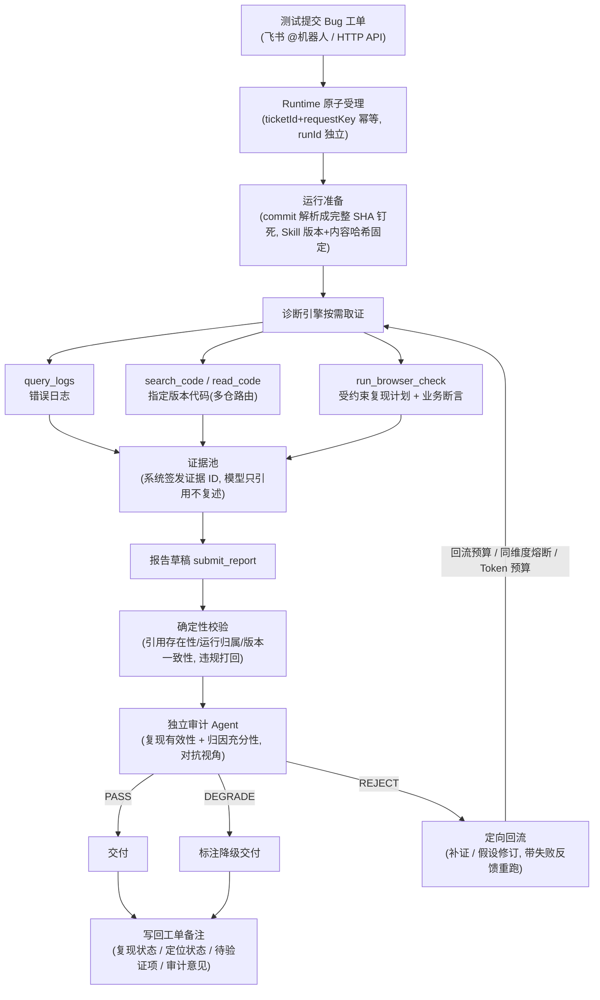
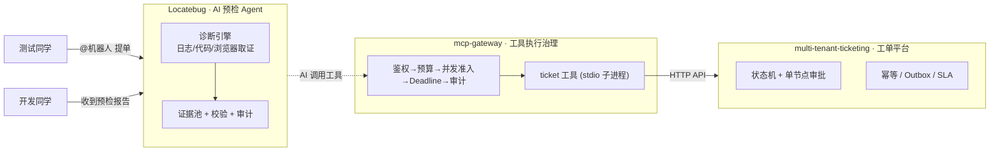

# ticket-doctor：Bug 工单自动预检 Agent

> 测试提单 → 开发响应之间有几小时的空窗。本 Agent 在工单提交时自动完成一轮"可核验"的预检：拉错误日志、查指定版本代码、浏览器复现，产出**每条结论都能追溯到证据编号**的预检报告，写回工单备注。
>
> 这是我的三个围绕"工单"场景的深度项目之一，三个项目累计 **111 项测试**，见文末[项目矩阵](#项目矩阵)。

## 一张图看懂诊断闭环



## 为什么它"可信"而不是"看起来可信"

LLM 诊断最常见的两个毛病：**引用错位**（让模型复述原文和行号，同一段代码命中多个文件就关联错）和**过度归因**（把一条日志说成根因）。本项目的解法是让模型"只引用、不创作"，让程序和独立审计把住关口：

- **证据 ID 化**：证据由 `EvidenceStore` 在工具执行时签发运行内唯一 ID；报告只提交 `evidenceIds`，来源、版本、行号由系统回填——引用错位在结构上不可能发生。
- **两道独立质检**：确定性校验器管"引用正确"（伪造/跨运行/版本不一致一律打回）；独立审计 Agent 用对抗视角管"归因充分"（默认假设报告有问题，三档结论 PASS/DEGRADE/REJECT）。
- **定向回流而非盲目重试**：审计不通过时按问题类型补证或修订假设，失败历史注入下一轮；回流预算、同维度熔断、token 预算四道闸门保证必然终止；降级交付保留已核实结论与待验证项。
- **三个正交维度，不许互相冒充**：材料完整性（complete/partial）、复现状态（浏览器跑出来的，不是模型说的）、定位状态（候选原因/已获支持/根因已验证——验证不过系统强制降级）。
- **全程可回放**：append-only JSONL 记录每次决策、工具调用、证据与审计事件，进度和报告都是事件投影；同工单不同 requestKey 可独立重跑，天然支持新旧 Skill 对照评测。
- **浏览器复现不越权**：模型只能提交白名单动作的复现计划（goto/fill/click/assert_text…），校验通过才开浏览器；执行状态与复现状态分开——"找不到按钮"是执行失败，不等于没有 Bug。

技术栈：TypeScript（Node 原生 TS）+ Pi Agent SDK + DeepSeek + Playwright 端口；60 项测试，纯函数核心零 SDK 依赖。

```bash
npm run doctor:demo      # 零模型成本,先看事件流和报告长什么样
docker compose up -d     # 容器化部署(HTTP API + 飞书机器人),见 DEPLOY.md
```

<a id="项目矩阵"></a>
## 项目矩阵：围绕"工单"的三个深度

| 项目 | 一句话定位 | 技术栈 | 规模 |
| --- | --- | --- | --- |
| **[Locatebug](https://github.com/5quan/Locatebug)**（本仓库） | AI 预检 Agent：让每条结论可追溯 | TypeScript · Pi SDK · DeepSeek | ~7K 行 / 60 测试 |
| **[multi-tenant-ticketing](https://github.com/5quan/multi-tenant-ticketing)** | 多租户工单平台：把业务正确性钉进事务边界 | Go · Gin · MySQL 8.4 | ~3.6K 行 / 36 测试 |
| **[mcp-gateway](https://github.com/5quan/mcp-gateway)** | MCP 工具网关：AI 调工具的执行治理 | Go · JSON-RPC 2.0 · Prometheus/OTel | ~2.5K 行 / 15 测试 |

三者不是孤立的三个 demo：**网关里的工单工具直接对接租户工单系统的 HTTP API**，而 AI 预检 Agent 与网关共享同一个理念——AI 的自由度越大，越要靠工程手段约束它的执行与结论。



### multi-tenant-ticketing：验证"业务正确性优先"的后端基本功

- **事务边界内解决并发**：状态迁移用条件更新（status+version），同版本并发操作只有一个成功；幂等记录、操作历史、Outbox 事件与业务变更同事务提交——不引入第二个状态源。
- **重试安全**：所有写操作支持 `Idempotency-Key`，客户端重试不产生第二次业务变更。
- **租户隔离做两层**：应用层显式携带租户范围 + 数据库复合外键兜底，跨租户访问一律拒绝。
- **可靠的异步通知**：事务性 Outbox，Worker 失败退避重试、超限转 FAILED 可重放、进程重启自动续投；P0 工单 30 分钟首次响应 SLA，事实保留不回改。

```bash
docker compose up --build -d && bash scripts/demo.sh   # 三人一次完整工单流转
```

### mcp-gateway：验证"AI 调用工具"的执行治理

- **标准 MCP 接入**：JSON-RPC 2.0 over Streamable HTTP（`initialize`/`tools/list`/`tools/call`），工具由独立 stdio 子进程提供，新增工具网关核心零改动；子进程崩溃有界退避自动重启。
- **可组合执行链**：`鉴权 → 工具范围 → 请求预算(速率+身份并发) → 并发准入(全局+工具级) → 执行 → 运行记录`，每条拒绝路径都有稳定错误码。
- **故障隔离**：慢工具只占自己的并发槽位，不拖垮其他工具；业务失败与协议失败严格区分（`isError=true` 不是 JSON-RPC error）。
- **Deadline 全链路传递**：客户端截止时间与网关上限取小后传到下游，超时/取消立即释放槽位。
- **可观测**：Prometheus 指标按工具×结局分类、OTel 追踪带 trace_id、运行事件有界异步队列落 JSONL 可在线查询。

```bash
make build && make seed && bash scripts/demo.sh   # 起网关 + 演示 + 指标/事件
```

## 工程习惯（三个项目一致）

- **契约先行**：领域契约与 SDK/适配器严格分层，换模型、换日志平台、换存储不动核心逻辑。
- **每个能力都有测试**：并发、幂等、预算、取消、审计回流都有确定性测试（111 项），不靠"跑一遍看起来对"。
- **可回放、可审计**：事件溯源式落库，出问题从事件流回放定位，而不是猜。

---

详细设计：[ticket-doctor](./docs/DESIGN.md) · [DEPLOY](./DEPLOY.md) · [多租户工单](https://github.com/5quan/multi-tenant-ticketing/blob/main/docs/DESIGN.md) · [MCP 网关](https://github.com/5quan/mcp-gateway/blob/main/docs/DESIGN.md)
